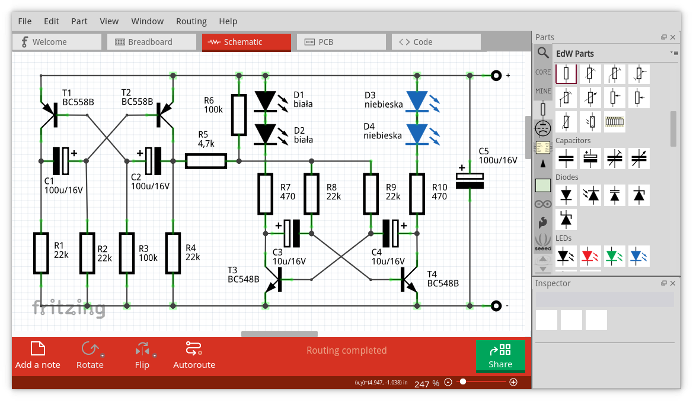
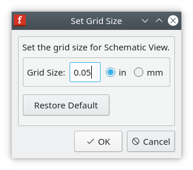
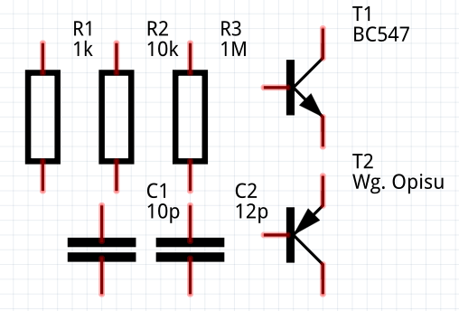

# EdW Fritzing Parts

This project is a library of electronics schema parts adjusted for [Fritzing](https://fritzing.org/home/) application, based on template provided by great polish magazine [Elektronika Dla Wszystkich](https://elportal.pl/).

All parts were originally designed and created by EdW's editor-in-chief [Piotr Górecki](https://www.facebook.com/Piotr-G%C3%B3recki-o-elektronice-105147944792967/).

This project was created to allow creating beautiful electronic schematics, without specific knowledge about SVG and graphics design. The project's goal is not a full integration with Fritzing project. It's containing only set of schematic elements without PCB and breadboard images. There are no plans so far to add them in future releases.

## Latest release

The newest version is `v0.1.0`.

## Install

Get latest version of tarball and extract it directly into `fritzing-parts` folder:

```
$ wget https://github.com/di0x7c5/edw-fritzing-parts/releases/download/v0.1.0/edw-fritzing-parts_v0.1.0.tar.gz
$ tar xzf edw-fritzing-parts_v0.1.0.tar.gz -C /opt/fritzing/fritzing-parts/
```

Then use built in application command to regenerate parts database from `Parts` -> `Regenerate parts database ...`, or use below command to do it the same from CLI:

```
$ Fritzing -db "/opt/fritzing/fritzing-parts/parts.db"
```

## Collection

All elements were splitted into 5 categories:

### 1. Generic

Contains generic elements like resistor, capacitor, transistor etc.

### 2. Lamps

Contains all elements related to electronic vacuum tubes.

### 3. IC

Integrated circuits, generic components, flip flops, CMOS and TTL series

### 4. Description

Labels, texts, arrows, symbols, etc.

### 5. Blocks

Used to build block diagrams or used for representing external components.

## Grid size

All elements are hand-made designed base on 0.5 inch mesh. There is necessary to set same value in Fritzing grid settings. Go to `Schematic` tab, then open menu `View` -> `Set Grid Size...` and set value `0.5` in.



After that operation all elements now should match each other perfectly:



## IC extension

`TBD`
